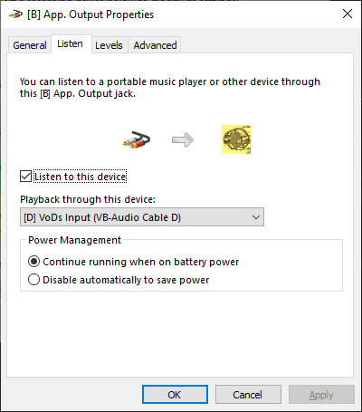
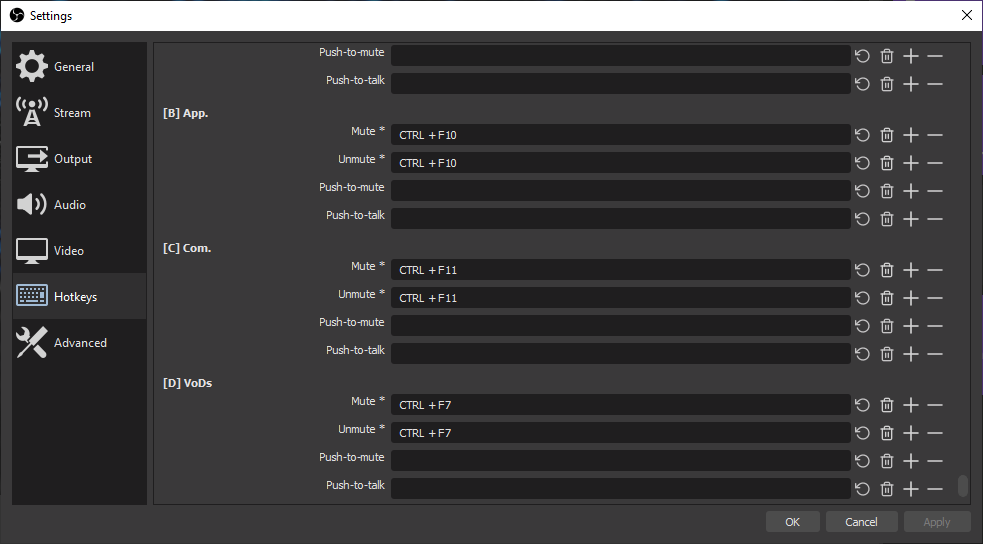

# How to split audio for Twitch live from VoDs & clips

The purpose of this write up is to allow you to have an audio source (refered to as "App" in the rest of this guide) available on the livestream but muted on the VoD and the clips of the aforementioned livestream.

## 1. Pre-requisites

- [OBS Studio](https://obsproject.com/download) or [Streamlabs OBS](https://streamlabs.com/)
- [Soundtrack by Twitch](https://www.twitch.tv/broadcast/soundtrack)
- A way to route you applications' audio separately (eg. [Voicemeeter Banana](https://vb-audio.com/Voicemeeter/banana.htm)[/Potato](https://vb-audio.com/Voicemeeter/potato.htm) with [Virtual Audio Cable](https://vb-audio.com/Cable/index.htm))

## 2. Instructions

After having everything installed and set.

You should:

- Have a source for Soundtrack in your scene (feel free to have it embedded within a nested scene)

    

- From the Edit dropdown menu in OBS, configure Advanced Audio Properties so that:
  - the audio sources you want on the livestream are active on track 1 (checkbox ticked)
  - the one that you want on the VoDs and the clips are active only on track 6

    eg. everything except what's coming out of "[B] App." in the following screenshot

  

- Soundtrack should also be up and running (preferably as admin) in order to route the audio from track 6 to the VoDs and the clips
- OBS sends the audio from track 1 to the livestream

## 3. (Optional) Setup virtual audio routing

Using [Voicemeeter Banana](https://vb-audio.com/Voicemeeter/banana.htm)[/Potato](https://vb-audio.com/Voicemeeter/potato.htm) and [Virtual Audio Cable](https://vb-audio.com/Cable/index.htm), you could set it up as per the following diagram

On Windows 10, you can access the App volume and device preferences pannel by typing the following command (Win + R):
`ms-settings:app-volumes`

[](./images/AudioDiagram.png)

## 4. Mute/Unmute App audio

There are a number of ways to achieve this but all in all, you'd need to have a seperate audio input which replicate the output from "[B] App.".

Using [Virtual Audio Cable](https://vb-audio.com/Cable/index.htm) additional cables for example, you could have the following setup:

- ```[B] App. Input``` is set as the output of Spotify from Windows app volume panel (Win + R, then type ```ms-settings:app-volume```).
- from Windows ```Sound``` panel (win+R, then type ```mmsys.cpl sounds```), activate the listen option of ```[B] App. Output``` and set it to ```[D] VoDs Output```

- if you don't have any available Aux Audio slot in OBS ```Global Audio Devices```, you can add an ```Audio input capture source``` to your scene and select ```[D] VoDs Output```.
- in OBS ```Advanced Audio Properties```, set it active only on Track 6 and you're all set.
- (optional) you can set a hotkey to mute/unmute that source


## 5. Known issues

It seems like this procedure doesn't always work for the clips made from the livestream player. But if you check the VoD of it (available a short while after you started it) it should be working as intended, even for the clips made from there.
