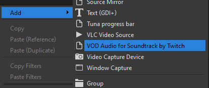
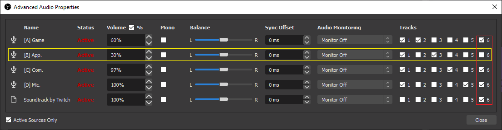
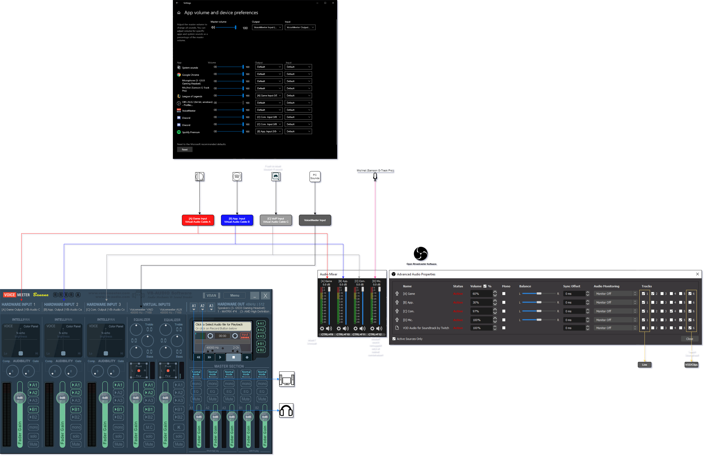

# How to split audio for Twitch live from VoDs & Clips

The purpose of this write up is to allow you to have an audio source available on the livestream but muted on the VoD and the clips of the aforementioned livestream.

## 1. Pre-requisites

- [OBS Studio](https://obsproject.com/download) or [Streamlabs OBS](https://streamlabs.com/)
- [Soundtrack by Twitch](https://www.twitch.tv/broadcast/soundtrack)
- A way to route you applications' audio separately (eg. [Voicemeeter Banana](https://vb-audio.com/Voicemeeter/banana.htm)[/Potato](https://vb-audio.com/Voicemeeter/potato.htm) with [Virtual Audio Cable](https://vb-audio.com/Cable/index.htm))

## 2. Instructions

After having everything installed and set.

You should:

- Have source for Soundtrack in your scene (feel free to have it embedded within a nested scene)

    

- From the Edit dropdown menu in OBS, Configure Advanced Audio Properties so that:
  - the audio sources you want on the livestream are active on track 1 (checkbox ticked)
  - the one that you want on the VoDs and the clips are active only on track 6

    eg. everything except what's coming out of "[B] App." in the following screenshot

  

- Soundtrack should also be up and running (preferably as admin) in order to route the audio from track 6 to the VoDs and the clips
- OBS sends the audio from track 1 to the livestream

## #TODO 3. (Optional) Setup virtual audio routing

Using [Voicemeeter Banana](https://vb-audio.com/Voicemeeter/banana.htm)[/Potato](https://vb-audio.com/Voicemeeter/potato.htm) and [Virtual Audio Cable](https://vb-audio.com/Cable/index.htm), you could set it up as per the following diagram

<!--  -->
